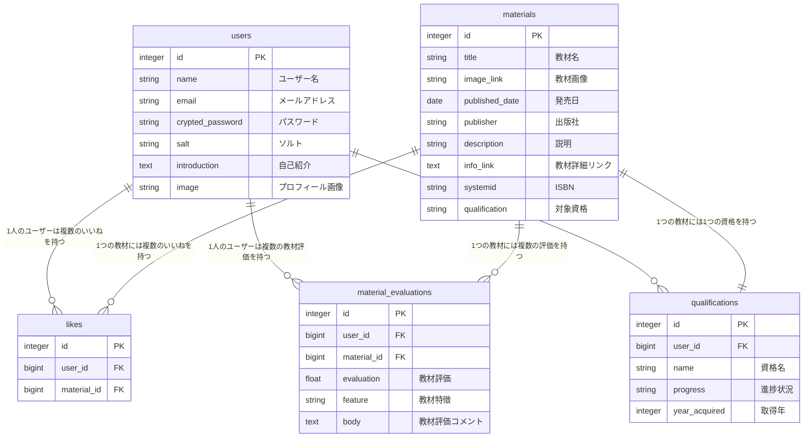

# 教材チョイス
「教材チョイス」は、自分に合った教材を見つけられるサービスです。  
アプリURL：https://www.kyouzaichoice.com/

## サービス概要
「教材チョイス」は、自分に合った教材を見つけられるサービスです。  
機能については、  
- ユーザーが使用した教材を登録することが出来ます。
- 教材一覧にて教材評価及びコメントを参考に自分に合ったサービスを見つけれます。
- 教材一覧では教材名及び資格名で検索が可能です

## このサービスへの思い・作りたい理由
私は今までいくつもの資格を受験してきました。勉強を開始する前には資格対策の教材をブログ等を見て選びますが
ブログ記事によって教材の評価が異なり、どの教材を選べがいいのか迷う事が多かったです。
実際、私は今までに何冊も合っていない教材を選び、挫折したり、資格に合格出来ない経験が多くありました。
資格勉強を始める時、人によってベース知識が異なっているため、ユーザーそれぞれに合った教材を見つけられるサービスを
作りたいと思いました。

## ユーザー層について
### 普段学習習慣がない新卒会社員
- 学習習慣がない方は自分にあった教材を選ぶ経験が少ないと考えます。
### 同じ資格に何度も落ちている社会人
- 何度も落ちているのはもしかしたら使用している教材が本人に合っていない可能性があると考えます。
### 受験する資格についてまったく知識がなく、初学者に合った資格を探したい
- 初学者の教材は多くどれを選んでいいか分からないため

## サービスの利用イメージ
- レスポンシブ対応によってPCとスマホの両方から使うことができます。
- 新しく資格勉強を始める際に使用する教材について調査する事ができます。
- 勉強する資格について未経験者が自分に合った教材を探す事ができます。
- 気になる教材を見つけて、楽天市場へのページ遷移ができます。

## ユーザーの獲得について
- SNS上で資格に関する情報を検索し、流れてくる情報を通じてこのアプリを知るきっかけになります。
- Xへのシェア機能

## サービスの差別化ポイント・推しポイント
- 資格取得に特化している点。
- 教材ごとに教材特徴を登録出来るようになっている。教材特徴を見る事で自分に合うか確認出来る点。
※教材特徴(初学者、経験者、1冊で合格、資格合格最低限内容、深掘りした内容、問題数多め、解説が丁寧)
- ブログ記事と比較し、評価するユーザー数が多い点。

## 機能一覧
- ユーザー登録
- ログイン機能(sorcery、ゲストログイン、Google認証)
- パスワードリセット
- 教材検索
- 教材登録
  - 教材特徴
  - 教材評価(0.0~5.0)
  - 教材評価コメント
- 登録した教材の編集・削除
- 資格登録・編集・削除
- 教材一覧画面
  - 教材いいね機能
  - Xへのシェア機能
  - 対象教材の楽天市場への移動

## 今後の開発について
- RSpecテスト追加
- 星評価機能
- 選択した教材を使った学習計画の作成機能

## 使用技術

| カテゴリ | 技術 |
| :--- | :--- |
| フロントエンド | Rails 7.0.8.4,JavaScript,TailwindCSS,DaisyUI |
| バックエンド | Rails 7.0.8.4 |
| db | PostqreSQL |
| インフラ | Render.com |
| 開発環境 | Docker  |
| API | Google Books API, Google API |
| テスト | Rspec,rubocop |

## 画面遷移図
https://www.figma.com/design/NltzbyZwRW21ovXWFdcWqG/%E7%94%BB%E9%9D%A2%E9%81%B7%E7%A7%BB%E5%9B%B3(%E6%95%99%E6%9D%90%E3%83%81%E3%83%A7%E3%82%A4%E3%82%B9)?node-id=0-1&t=ihXJZkdRmva2cMUB-1

## ER図
https://drive.google.com/file/d/1Xn-EkriCBAvjoMeqydluJepcw_i_OKGv/view?usp=sharing

