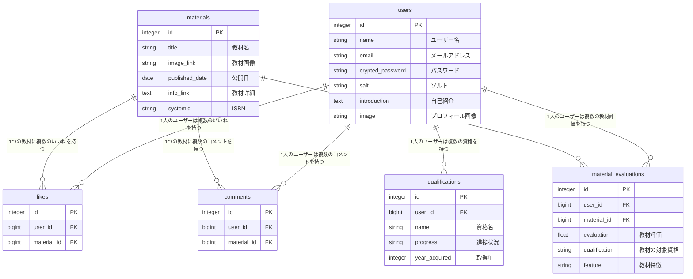

# 教材チョイス

## サービス概要
「教材チョイス」は、自分に合った教材を見つけれるサービスです。また、学習記録を投稿してユーザーと交流できます。
ブログ記事は個人の感想であり、ブログ記事作成者によって教材評価が異なっており教材選びに迷う事が多いと思います。
ブログ記事に比べ、このサービスではユーザーの数だけ評価があるため、より公平な評価を参考することが出来ます。
また、投稿機能では教材検索機能を用意しているため、同じ教材を使って学習している方と交流することが出来ます。

## このサービスへの思い・作りたい理由
私は今までいくつもの資格を受験してきました。勉強を開始する前には資格対策の教材をブログ等を見て選びますが
ブログ記事によって教材の評価が異なり、どの教材を選べがいいのか迷う事が多かったです。
実際、私は今までに何冊も自分に合っていない教材を選び、挫折したり、資格に合格出来ない経験が多くありました。
資格勉強を始める時、人によってベース知識が異なっているため、ユーザーそれぞれに合った教材を見つけられるサービスを
作りたいと思いました。

## ユーザー層について
- ①ユーザー層：普段学習習慣がない新卒会社員1年目男性
- ①理由　　　：学習習慣がない方は自分にあった教材を選ぶのに苦戦すると感じているため
- ②ユーザー層：同じ資格に何度も落ちている社会人
- ②理由　　　：何度も落ちているのはもしかしたら使用している教材が本人に合っていない可能性があるため。
- ③ユーザー層：受験する資格についてまったく知識がなく、初学者に合った資格を探したい
- ③理由　　　：初学者の教材は多くどれを選んでいいか分からないため

## サービスの利用イメージ
- ①新しく資格勉強を始める際に使用する教材について調査するため
- ②勉強する資格について未経験者が自分に合った教材を探すため
- ③同じ資格取得を目指しているユーザーと交流する
- ④スマホから利用する

## ユーザーの獲得について
- SNS上で資格に関する情報を検索し、流れてくる情報を通じてこのアプリを知るきっかけになります。
- Twitterでの告知

## サービスの差別化ポイント・推しポイント
・資格取得に特化している点
・教材ごとに教材特徴を登録するようになっている。教材特徴を見る事で自分に合うか確認出来る。
　※教材特徴(初学者、経験者、1冊で合格、資格合格最低限内容、深掘りした内容、問題数多め、解説が丁寧)
　オススメの人を選択」ボタンを押して約10個の項目から教材についてオススメの人を登録します
  →教材一覧画面で各ユーザーが選択した「オススメの人」の項目をバー長さと数で表示する。
・ブログ記事と比較し、評価するユーザー数が多い

## 機能候補
### MVPリリース
- ユーザー登録
- ログイン機能
- 教材登録機能
- 教材いいね機能
- 資格登録機能

### 本リリース
- パスワードリセット機能
- Googleログイン機能
- LINEログイン機能
- 投稿機能
- 投稿いいね機能
- 星評価機能
- トップページスライダー
- 利用規約ページ
- お問い合わせページ
- プライバシーリポジトリー

# 機能の実装方針予定
## 使用技術
- LINE Developers
　 LINEログイン機能
- omniauth-google-oauth
　 Googleログイン機能
- Google Books API
　教材情報を取得

## 開発環境
- 開発環境
  - Docker 
- サーバーサイド
  - RUby on Rails 7.0.8.4
- インフラ
  - Render
- CSS
  - Tailwind × DaisyUI
- フロントエンド
  - JavaScript
- データベースサーバー
  - PostgresSQL
- VCS
  - GitHub

### 画面遷移図
https://www.figma.com/design/NltzbyZwRW21ovXWFdcWqG/%E7%94%BB%E9%9D%A2%E9%81%B7%E7%A7%BB%E5%9B%B3(%E6%95%99%E6%9D%90%E3%83%81%E3%83%A7%E3%82%A4%E3%82%B9)?node-id=0-1&t=ihXJZkdRmva2cMUB-1

### ER図
https://drive.google.com/file/d/1Xn-EkriCBAvjoMeqydluJepcw_i_OKGv/view?usp=sharing

