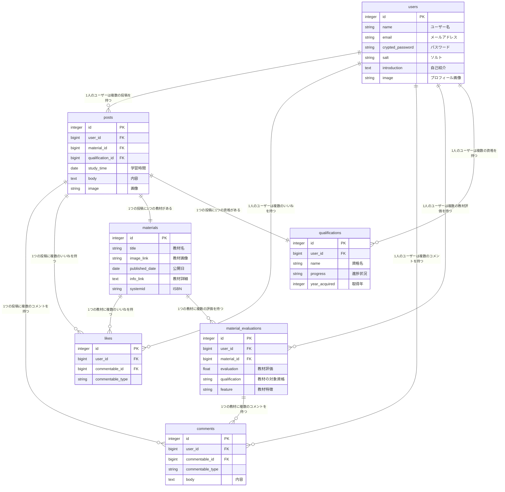

# 資格とろ！

## サービス概要
資格勉強を始める方(既に始めている方)へ  
資格とろ！(仮)では、資格取得の勉強に利用した教材(テキスト・アプリ・スクール)を共有するサービス。また、学習記録を投稿してユーザーと交流できます。
ブログ記事は個人の感想であり、ブログ記事作成者によって教材評価が異なっており教材選びに迷う事が多いと思います。
ブログ記事に比べ、このサービスではユーザーの数だけ評価があるため、より公平な評価を参考することが出来ます。
また、投稿機能では教材検索機能を用意しているため、同じ教材を使って学習している方と交流することが出来ます。

## このサービスへの思い・作りたい理由
私は今までいくつも資格試験を受けてきました。勉強を開始する前には資格対策の教材を色々と調べて選びますが
ブログ記事によって教材の評価が異なり、どの教材を選べがいいのか迷う事が多かったです。
実際、私は今までに何冊も自分に合っていない教材選び、挫折したり、資格に合格出来ない経験が多くありました。
資格勉強を始める時は人によってスタートラインが異なっているため、人に合った教材を見つけられるサービスにしたい。
また投稿機能に教材と資格の検索機能を用意しているため、より親近感を持ったユーザー同士の交流が可能と思います。

## ユーザー層について
- ①ユーザー層：普段学習習慣がない新卒会社員1年目男性
- ①理由　　　：学習習慣がない方は自分にあった教材を選ぶのに苦戦すると感じているため
- ②ユーザー層：同じ資格に何度も落ちている社会人
- ②理由　　　：何度も落ちているのはもしかしたら使用している教材が本人に合っていない可能性があるため。
- ③ユーザー層：受験する資格についてまったく知識がなく、初学者に合った資格を探したい
- ③理由　　　：初学者の教材は多くどれを選んでいいか分からないため

## サービスの利用イメージ
- ①新しく資格勉強を始める際に使用する教材について調査するため
- ②勉強する資格について未経験者が自分に合った教材を探すため
- ③同じ資格取得を目指しているユーザーと交流する
- ④スマホから利用する

## ユーザーの獲得について
- SNS上で資格に関する情報を検索し、流れてくる情報を通じてこのアプリを知るきっかけになります。
- Twitterでの告知

## サービスの差別化ポイント・推しポイント
・資格取得に特化している点
・教材ごとに「オススメの人」「オススメ出来ない人」が分かるようになっている。
　オススメの人を選択」ボタンを押して約10個の項目から教材についてオススメの人を登録します
  →教材一覧画面で各ユーザーが選択した「オススメの人」の項目をバー長さと数で表示する。
・ブログ記事と比較し、評価するユーザー数が多い

## 機能候補
### MVPリリース
- トップページ
    - サービスの説明
     　利用方法について説明
    - サービスの使い方
    　　　 各機能についてテキストと動画で説明(資格登録、教材登録、投稿機能、教材一覧)
- ユーザー登録
    - 入力フォーム(ユーザー名、メールアドレス、パスワード、パスワード確認)
    - 画像挿入
    - ボタン(登録)
- ログイン
    - 入力フォーム(メールアドレス、パスワード)
    - ボタン(新規登録はこちら、パスワードを忘れた方はこちら！、ログイン)
- パスワードリセット
    - 入力フォーム(メールアドレス)
    - ボタン(送信)
- マイページ
  - ユーザー情報
    - 表示(ユーザー画像用の枠、ユーザー名、メールアドレス、自己紹介 選択項目[ユーザー情報、資格、教材、投稿])
    - 編集機能(ユーザー名、メールアドレス、自己紹介)
  - 教材
    - 表示(選択項目[ユーザー情報、資格、教材、投稿])
    - 入力フォーム(教材名、教材評価、オススメの人、コメント)
    - ボタン(キャンセル、登録、編集、削除、教材追加)
- 教材一覧ページ
  - 表示(教材名、教材画像、オススメの人、評価)
  - 検索機能用
  - 編集ボタン
  - いいねロゴ、いいね数
  - コメントロゴ、コメント数

### 本リリース
- トップページ
  - スライダー
- ユーザー登録
  - Google認証
  - LINE認証
- ログイン
  - Google認証
  - LINE認証
- マイページ
  - 資格
    - 選択項目表示[ユーザー情報、資格、教材、投稿]
    - 入力フォーム(資格名、進捗状況、取得年数)
    - ボタン(キャンセル、登録、編集、削除、資格追加)
  - 教材(MVPで実装済み)
  - 投稿
    - 表示
      - 自分が投稿した内容
      - 自分がいいねしたユーザー投稿内容
      - 選択項目[ユーザー情報、資格、教材、投稿]
- 投稿新規作成ページ
  - リスト(資格、使用教材)
  - 入力フォーム(勉強時間、内容)
  - 画像挿入
  - ボタン(投稿)
- 投稿一覧ページ 
  - 検索機能
    - 入力フォーム(教材名、資格名、オススメの人)
  - 投稿内容表示 
    - 投稿ユーザー名
    - 学習時間(**:**)
    - 内容
    - 画像(投稿添付)
    - コメント表示(ロゴ、コメント数)
    - いいねロゴ、いいね数
  - 編集ボタン(ログインユーザーが投稿した物のみ)
  - タグ表示
    - 資格名
    - 教材名
- 投稿詳細ページ
  - 投稿内容
    - 投稿ユーザー名
    - 学習時間(**:**)
    - 内容
    - 画像(投稿添付)
    - コメント表示(ロゴ、コメント数)
    - いいねロゴ、いいね数
  - コメント機能
    - ボタン(投稿)
    - 各ユーザーが投稿したコメントを表示
- 投稿編集ページ
  - リスト(資格、使用教材)
  - 入力フォーム(勉強時間、内容)
  - 画像挿入
  - ボタン(更新)
- 利用規約
- プライバシーポリシー
- お問い合わせ

# 機能の実装方針予定
## 使用技術
- LINE Developers
　 LINEログイン機能
- omniauth-google-oauth
　 Googleログイン機能
- AppleのiTunes Search API
  IOSアプリ情報取得
- Google Play Developer API
　Androidアプリ情報取得
- Google Books API
　教材情報を取得

## 開発環境
- 開発環境
  - Docker 
- サーバーサイド
  - RUby on Rails 7.0.8.4
- インフラ
  - Render
- CSS
  - Tailwind × DaisyUI
- フロントエンド
  - JavaScript
- データベースサーバー
  - PostgresSQL
- VCS
  - GitHub

### 画面遷移図
https://www.figma.com/design/NltzbyZwRW21ovXWFdcWqG/%E7%94%BB%E9%9D%A2%E9%81%B7%E7%A7%BB%E5%9B%B3?node-id=0-1&t=bVqRzGn18NpFxjtj-0

### ER図
https://drive.google.com/file/d/1Xn-EkriCBAvjoMeqydluJepcw_i_OKGv/view?usp=sharing

